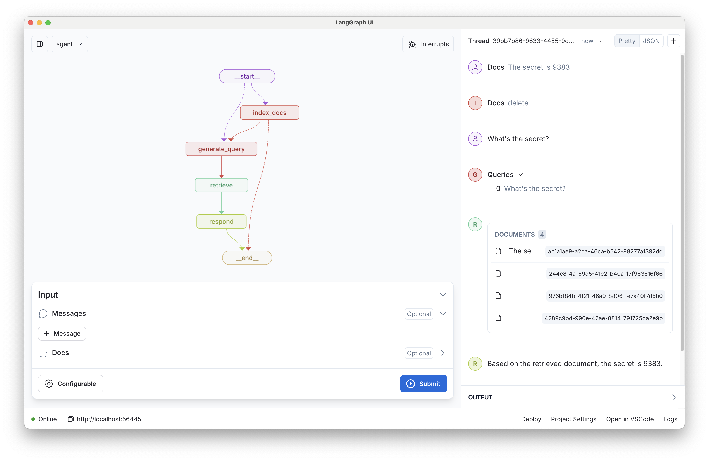

<!--
Configuration generated from `langgraph template lock`

{
  "config_schemas": {
    "graph_name": {
      "environment": ["ANTHROPIC_API_KEY", "FIREWORKS_API_KEY", "OPENAI_API_KEY", "ELASTICSEARCH_CLOUD_ID", "ELASTICSEARCH_API_KEY"]
    }
  }
}
-->

# LangGraph Retrieval Agent Template

This LangGraph template implements a simple, extensible agent that answers questions based on a retriever.



## Project Prerequisites

Assuming you've already [installed LangGraph Studio](https://github.com/langchain-ai/langgraph-studio/releases) and cloned this repo.

By default, this template uses:
- OpenAI `text-embedding-3-small` model for embedding documents. Requires an OpenAI API key to be configured.
- Anthropic `claude-3-5-sonnet` for generating responses. Requires an Anthropic API key to be configured.
- Elasticsearch for retrieval and indexing on vectorised documents. 

All that's left is to index documents into Elasticsearch through the indexer graph (or your selected search provider).

Copy the [.env.example](.env.example) file. We will copy the relevant environment variables there:

```bash
cp .env.example .env
```

### Setup Elasticsearch

You can setup a local Elasticsearch instance or use Elastic Cloud.

#### Locally with Docker

```
docker run -p 127.0.0.1:9200:9200 -d --name elasticsearch --network elastic-net \
  -e ELASTIC_PASSWORD=changeme \
  -e "discovery.type=single-node" \
  -e "xpack.security.http.ssl.enabled=false" \
  -e "xpack.license.self_generated.type=trial" \
  docker.elastic.co/elasticsearch/elasticsearch:8.15.1
```

See the [official Elastic documentation](https://www.elastic.co/guide/en/elasticsearch/reference/current/run-elasticsearch-locally.html) for more information on running it locally.

Then use the `.env.example` to create an `.env` file with the following:

```
# As both Elasticsearch and LangGraph Studio runs in Docker, we need to use host.docker.internal to access.
ELASTICSEARCH_URL=http://host.docker.internal:9200
ELASTICSEARCH_USER=elastic
ELASTICSEARCH_PASSWORD=changeme
```

#### On Elastic Cloud

1. Signup for a free trial with [Elastic Cloud](https://cloud.elastic.co/registration?onboarding_token=search&cta=cloud-registration&tech=trial&plcmt=article%20content&pg=langchain).
2. Get the Elasticsearch URL, found under Applications of your deployment.
3. Create an API key. See the [official elastic documentation](https://www.elastic.co/search-labs/tutorials/install-elasticsearch/elastic-cloud#creating-an-api-key) for more information.
4. Copy the URL and API key to your `.env` file created above:

```
ELASTICSEARCH_URL=<ES_URL>
ELASTICSEARCH_API_KEY=<API_KEY>
```

Once you've set this up, you can open this template in LangGraph studio.

## Graphs

This template contains two graphs, each in separate files.

1. [index](./retrieval_graph/index_graph.py)

This "graph" is merely a single endpoint that lets a user post content to be indexed.

All documents are stored with the user's user_id (provided via configuration) as metadata so it can be filtered per-user.

2. [retrieval_graph](./retrieval_graph/graph.py)

This is a simple pipe for conducting conversational RAG. It has 3 primary steps as nodes.

1. Generate query: either take the user's input (if first step) or call an LLM to generate the query based on the conversation.
2. Retrieve docs: this uses the retriever [stored in context](https://langchain-ai.github.io/langgraph/how-tos/state-context-key/) to fetch docs, filtered by the user_id.
3. Generate response: call an LLM with the conversation + formatted doc results.

## Repo Structure

```txt
├── LICENSE
├── README.md
├── langgraph.json
├── poetry.lock
├── pyproject.toml
├── retrieval_graph
│   ├── __init__.py
│   ├── index_graph.py # Simple graph that exposes an api from which users can index docs
│   ├── graph.py
│   └── utils
│       ├── __init__.py
│       ├── configuration.py # Define the configurable variables
│       ├── state.py # Define state variables and how they're updated
│       └── utils.py # Other sundry utilities
└── tests # Add whatever tests you'd like here
    ├── integration_tests
    │   └── __init__.py
    └── unit_tests
        └── __init__.py
```

r
